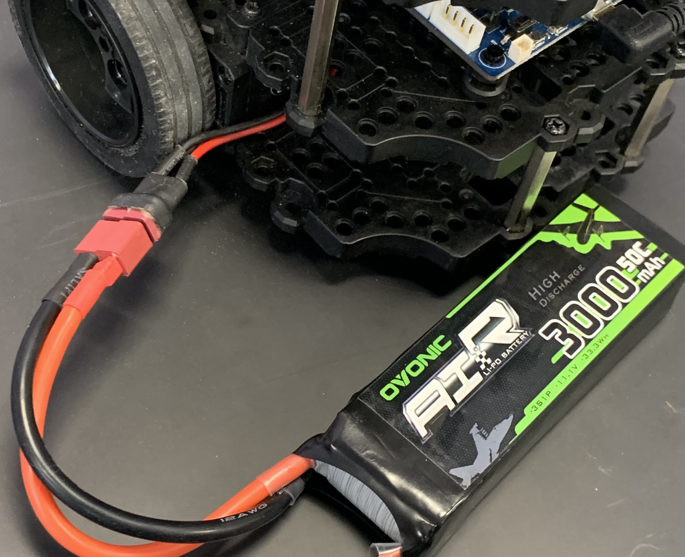

# Connecting to Turtlebot3 or Plaform Robots from VNC

Before you get started, make sure you have the latest version of `rosutils` on your VNC
To update rosutils, use the command `cd ~/rosutils && git pull`

You will then need to run the command `source ~/.bashrc` after updating rosutils


## Turning on the robot (Turtlebot3)

1. Make note of the name of your robot written on the top. 


2. Connect the battery to the robot.


3. Turn on the robot using the switch just under the camera.


4. You should see the lights on the raspberry pi in the robot turn green. The robot may take up to a minute to finish its boot sequence.


## Steps to connect

1. Make note of the name of your robot. It should be written on the top of the robot. For the purposes of this tutorial, I will be connecting to **roba**, but you should replace **roba** with the name of your robot.
2. Run `tailscale status | grep roba` in a terminal. You should get an output that looks something like this: `100.86.78.102   roba               pitosalas@   linux   -`. Make note of the IP starting with 100, this is the IP address of your robot.
3. Edit the file `~/.bashrc` in your vscode editor on the VNC. Add the following two lines to the bottom of the file, but in the second line you will need to replace where it says `roba` and the IP address with the name of your robot and your robot's IP address respectively.
```
$(bru mode real)
$(bru name roba -m 100.86.78.102)
```
4. Run the command `sb` in the terminal. You should see your command prompt change to something that looks like this: `[real:roba]`
5. If the robot is already on, run the command `sshrobot` in your terminal in your VNC. You might be asked to add a new ssh fingerprint, if so simply type `yes` in the prompt and continue. You will be asked the password of the robot, which is going to be `ROSlab134` for all of the lab robots.
6. Once you see that your terminal prompt looks like `[onboard:roba]` you are connected to the robot. The final step is to type `bringup` in the robot's terminal. This will run the bringup script so it is crucial that you do not close the terminal where this is running.