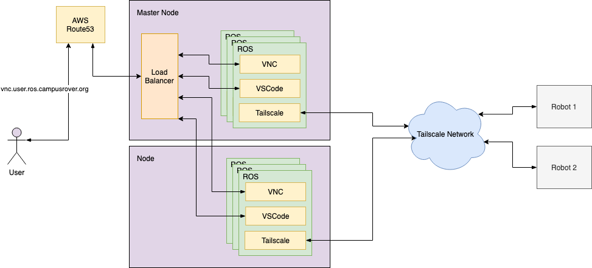

# Architecture

## Overview

The cloud desktop architecture is simple. On a high level, it looks like this:

## Cloud Desktop Cluster

Cloud desktop cluster is a cluster of cloud desktops. It is implemented as a K8s cluster for easy scheduling and orchestration of cloud desktop containers.

## Cloud Desktop Container

The cloud desktop container provides a virtualized desktop environment that is isolated and portable. It consists of 3 components.

- VNC server paired with a NoVNC server
- VSCode server
- Tailscale client

For details, see [Container Image](image.md).

## Networking

K8s network:
- Used for communication with the load balancer to allow each container to be accessible from a URL
- Implemented with Flannel

Tailscale network:
- Used for communication between cloud desktops and robots globally
- Managed with [Tailscale Dashboard](https://login.tailscale.com/admin/machines)

AWS Route53:
- Provides DNS records for redirecting traffic to the cluster
