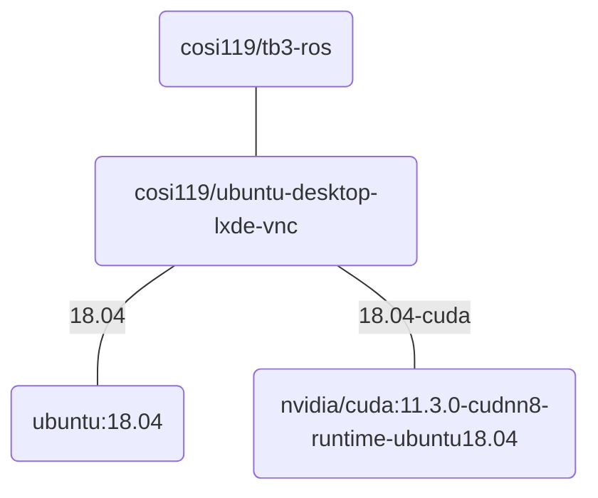

# Container Image

Cloud Desktop Container uses a custom docker image. The `Dockerfile` is located [here](https://github.com/pitosalas/tb3-ros).

## Image Defaults

Catkin Workspace: `/my_ros_data/catkin_ws`

Ports:

- `novnc` 80
- `vnc` 5900
- `vscode` 8080

## Image Layers

The current container image is structured this way:



`cosi119/tb3-ros`
  - installs ROS melodic and ROS packages
  - installs custom packages used in class, like `prrexamples`

`cosi119/ubuntu-desktop-lxde-vnc`
  - provides a Ubuntu image with novnc and lxde preconfigured.
  - provides a CUDA enabled variant via `-cuda` tag

## Adding packages to workspace

To add a package to the default catkin workspace, modify the `Dockerfile` under `tb3-ros/tb3-ros/Dockerfile`:

```dockerfile
# Add the following lines
WORKDIR /my_ros_data/catkin_ws/src
RUN git clone --recursive --depth=1 https://github.com/ROBOTIS-GIT/turtlebot3_msgs.git
```

## Github Repo

[pitosalas/tb3-ros](https://github.com/pitosalas/tb3-ros)
