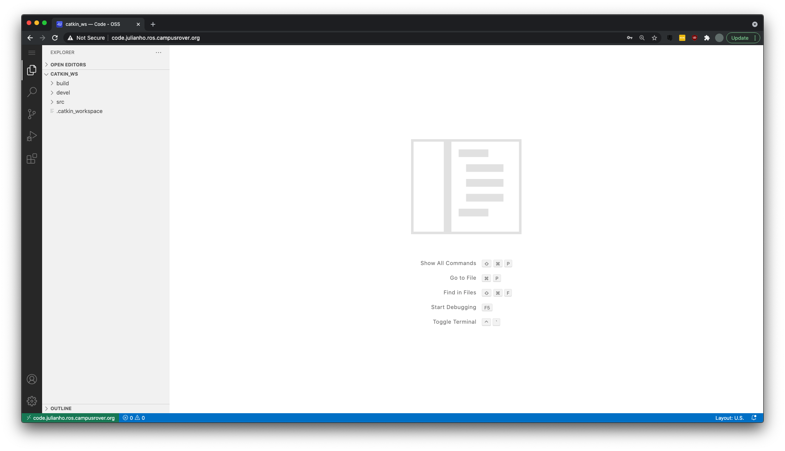
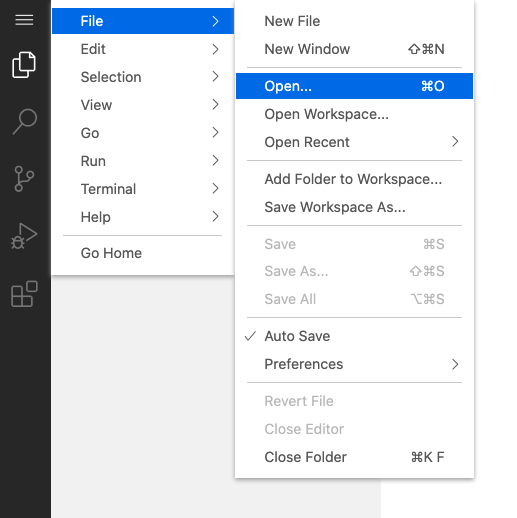
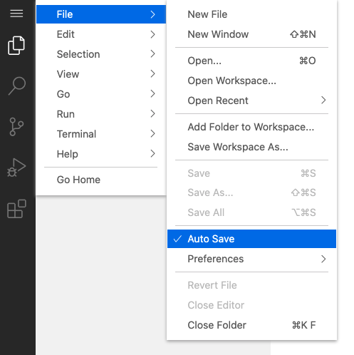
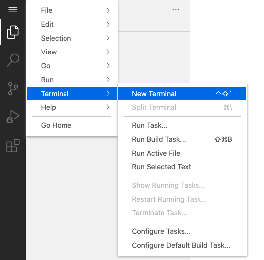

# Code Editor

## Access

Login to the provided link `http://code.USER.ros.campusrover.org` and enter your password (should be provided to you by TA).

## Open a Folder

To open a folder or file, go to `File` -> `Open`.

## Autosave

VSCode allows auto-saving. This is super helpful in case of a crash. To enable it,
go to `File` -> Choose `Auto Save`.

## Terminal

VSCode comes with a terminal. This is the same terminal as the one in the Desktop UI. To open a new terminal, go to `Terminal` -> Choose `New Terminal`.

