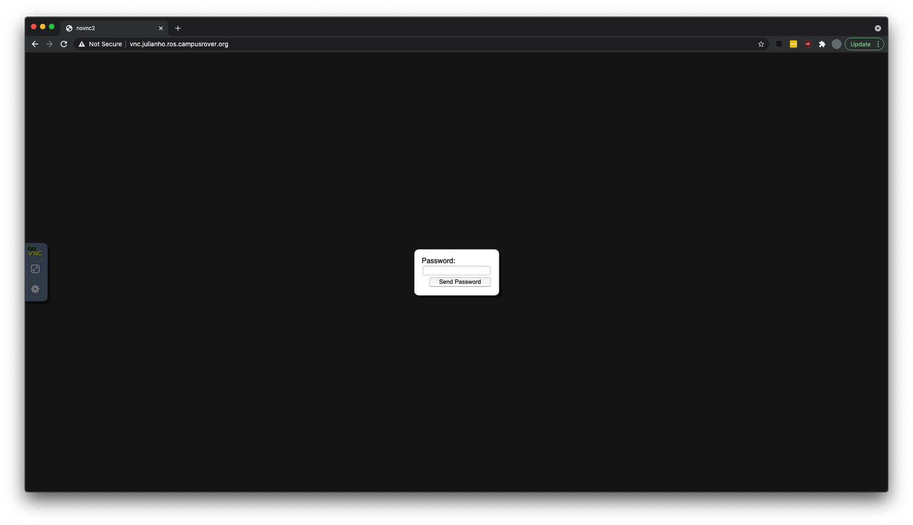
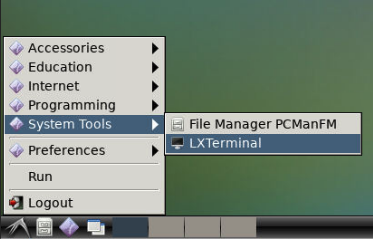
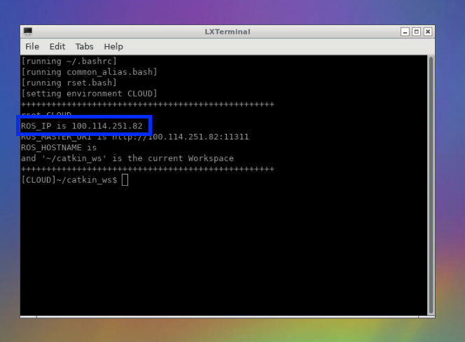

# Desktop

## Access

Login to the provided link `http://vnc.USER.ros.campusrover.org` and enter your password (should be provided to you by TA).

## Control

On the left you can find a panel for desktop control such as window scaling.

Left panel:

- Extra keys (ctrl-alt, esc key)
- Clipboard (use this for copy-and-paste)
- Fullscreen
- Settings
  - Scaling Mode -> "Local Scaling" (always)

On the bottom is the taskbar (similar to the one in Windows).

## Window Scaling

To make sure the desktop fits your browser window, go to `Settings` -> `Scaling Mode` -> Choose `Local Scaling`.

## Open Terminal

To open the terminal, click the start button at bottom-left corner, go to `System Tools` -> Choose `LXTerminal`.

## Tailscale IP

Each clouddesktop has a special IP for connecting to our global private network. The tailscale IP can be found on the terminal.

## Restart Desktop

To restart the clouddesktop in case of a freeze, **open a terminal in Code Editor**, type `restart`.

If that did not work, please reach out to your TA.
