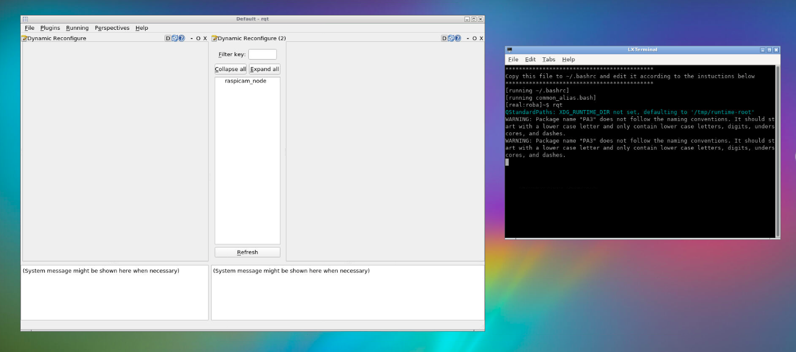
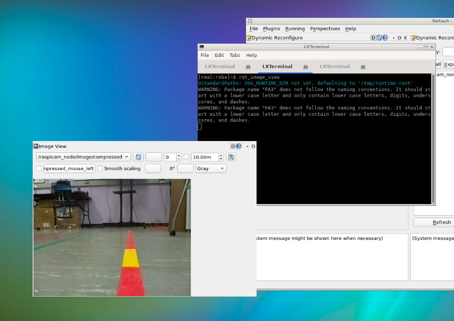

# Finding the HSV Values for any Color

by Sampada Pokharel

This is a quick guide to finding the HSV values for any color that you may need for you project. We found this particularly helpful for following a line.

## Prerequisite

- A robot with a camera
- VNC

## Basic Steps

1. Connect your robot. You can find the guide <a href = "https://campus-rover.gitbook.io/lab-notebook/bru/connect-to-robot"> here </a>
2. Once your robot is connected, open vnc and run cvexample.py file in the terminal.

```bash
rosrun prrexamples cvexample.py
```

3. In a seperate terminal, run rqt.

```bash
rqt
```



4. In rqt window, click Plugning -> Dynamic Reconfigure

5. Click cvexample and the hsv slides should pop up.

6. Adjust the sliders to find the hsv values for your desired colors.

<br>
In a seperate terminal, run rqt_image_view to get a larger frame of the camera image. This is optional.

```bash
rqt_image_view
```


