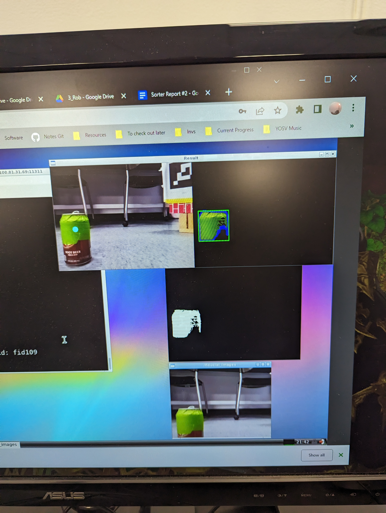

# Masking and Image Preparation

To start off, you need to process the image by removing all the sections that don't contain your target color. To do this we use opencv's inRange() function.

An example of how to do this for red using a ROS compressed image message is

`
image = self.bridge.imgmsg_to_cv2(imagemsg)

hsv = cv2.cvtColor(image, cv2.COLOR_BGR2HSV)
        
lower_red = np.array([170,80,80])
upper_red = np.array([190,255,255])

mask = cv2.inRange(hsv, lower_red, upper_red)
output = cv2.bitwise_and(image, image, mask=mask)
`

An important note is that the Hue in the hsv array for the inRange() function is interpreted on a scale of 0-180, while saturation and value are on a scale of 0-255.

This is important when comparing to a site like [this colorpicker](https://colorpicker.me/#489464). Which measures hue from 0-360 and saturation and value from 0-100.

# Identifying and using Contours

The following code will mark the contours and identify the largest one by area and then outline it with a rectangle.
`
ret,thresh = cv2.threshold(mask, 40, 255, 0)
        if (int(cv2.__version__[0]) > 3):
            contours, hierarchy = cv2.findContours(thresh, cv2.RETR_EXTERNAL, cv2.CHAIN_APPROX_NONE)
        else:
            im2, contours, hierarchy = cv2.findContours(thresh, cv2.RETR_EXTERNAL, cv2.CHAIN_APPROX_NONE)

        if len(contours) != 0:
            # draw in blue the contours that were founded
            cv2.drawContours(output, contours, -1, 255, 3)

            # find the biggest countour (c) by the area
            c = max(contours, key = cv2.contourArea)
            x,y,w,h = cv2.boundingRect(c)

            cx = x + (w/2)
            cy = y + (h/2)

            # draw the biggest contour (c) in green
            cv2.rectangle(output,(x,y),(x+w,y+h),(0,255,0),2)
`
cx and cy are the center point of the rectangle. You can use them or something else like a centroid to integrate this code into your program, such as to drive towards an object or avoid it.

# Example Image

In this image, the bottom left window is the original image, 

the second from the bottom is the mask of the target color (green in this example), 

the top right is the blue contour around the target color with a green rectangle identifying it as the largest contour,

and the top right is the original image with a center point (calculated from the rectangle) that I used for navigation in my project

