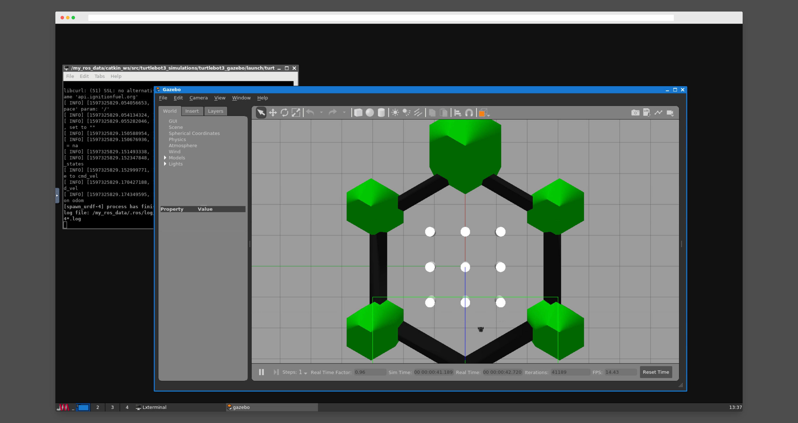

# How to use the Rover Cluster



## Introduction

Cloud desktop is a virtual desktop environment which you can access with just your browser. This allows you to run intensive robot simulations without your computer breaking down.

You can access your cloud desktop with one of three ways:

* [Virtual desktop environment via `novnc`](#accessing-virtual-desktop)
* [Browser-based code editor via `vscode`](#accessing-code-editor)
* [SSH](#accessing-via-ssh)

## Accessing virtual desktop

### Requirements

* Browser with javascript blocking turned *off*

For access link and password, please refer to the credentials given to you by the TA.

## Accessing code editor

### Requirements

* Browser with javascript blocking turned *off*

For access link and password, please refer to the credentials given to you by the TA.

## Accessing via SSH

### Enable SSH for remote access

Cloud desktop comes with SSH access disabled.

* To enable ssh, first login using cloud desktop/VScode
* Open up the terminal
* Run `sudo passwd root` to setup a password

### Access

You can now `ssh` in using the cloud desktop link given to you.

Using the terminal

```sh
ssh root@desktop1.ros.campusrover.org -p 2222
```

## Private Networking

All cloud desktops are, by default, connected to a shared private Tailscale network. Using the cloud desktop, you can connect to any robots on the network anywhere in the world.

```

  100.89.2.122 desktop-1 \       / robot-1 100.89.2.122
                          \     /
  100.99.32.12 desktop-2 - - - - - robot-2 100.99.31.234
                           /    \
  100.88.77.234 desktop-3 /      \ robot-3 100.86.232.111

```

Each robot on the network is assigned with a Tailscale IP which looks like this: `100.xx.xxx.xxx`

```bash
ssh root@100.89.2.122 # IP of robot-1
```

For more details and troubleshooting about Private Networking, see [this](private-networking.md).

## Troubleshooting

### What is my IP address?

Run the following command

```sh
ip addr show dev tailscale0 | grep -Eo '([0-9]{1,3}[\.]){3}[0-9]{1,3}'
```

### What is my hostname?

Run the following command

```sh
cat /etc/hostname
```

### Virtual desktop refused to login

If repeated attempts to login through the browser failed, it is likely that your desktop has crashed. Please notify your TA, he/she will restart your desktop for you.

### White blank screen when visiting the code editor

This is usually an issue with slow internet connection, give it a while to load.

If nothing shows up within 5 minutes, try `right click > inspect > console` to look for any error messages. Please then notify your TA with the error message.
