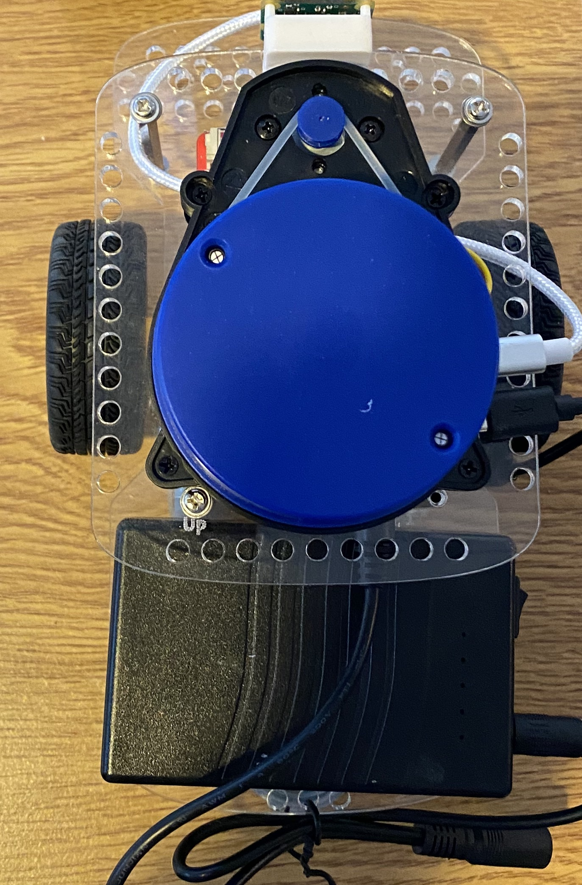
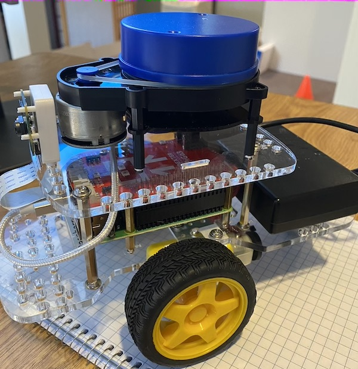

## MiniRover

**UNDER CONSTRUCTION**

MiniRover is our modification of the GoPiGo3 robot. It comes with software, a VPN and all kinds of fancy things which is why I decided to give it a special name. This page is under construction as I troubleshoot and make notes about things. I expect feedback from everyone where the instructions don't meet reality!

### Building

#### GoPiGo3 Basic Kit

We recommend that you start with a [GoPiGo3 Basic Kit](https://www.dexterindustries.com/store/gopigo3-base-kit/). Build it following the instructions. There is a lot written and a lot to google about it. Here are some useful links:

* [Dexter Forum](https://www.dexterindustries.com/store/gopigo3-base-kit/) - where you can get many questions answered
* [Build your GoPiGo3](https://edu.workbencheducation.com/cwists/preview/26659x) - where you find step by step instructions.
* [MiniRover Purchase Program](http://cosi119r.s3-website-us-west-2.amazonaws.com/content/background/13_gpg_purchase.md/) - instructions for students taking Cosi119a at Brandeis University to order a miniRover.

In addition to what you received with the Basic Kit you will need the following to get through the instructions.

* A Raspberry Pi 3+
* A battery pack
* Y-Cable
* A MicroSD card

The Battery pack is different form what the instructions talk about. The Y-Cable is used to connect the barrel connector of the battery pack with the corresponding battery connector on the "Red Board" which in turn will power the Raspberry Pi.

The robot will come with a microSD card with the dexter software. There is some very very simple calibration that you need to do.

#### Battery Pack

The battery pack is specific in terms of voltage and capacity. Don't substitute it for another one. It also comes with a charger. Note that the battery pack needs to be in the "on" position in order to have the charger do anything. And obviously it has to be in "ON" for the robot to work.

* We use only two of the 3 ends of the Y-connector. One goes into the barrel connector on the red board, and one goes into the barrel connector on the battery pack. 

* We then connect the very short usb cable with one end in the battery pack and the other end in the "power" connection of the lidar board.

#### Camera

You will have bought the camera separately, but the instructions talk about how to mount it to the robot. Make sure it is centered in all three dimensions. A good spot is on the front of the top plexiglass part. It can be do without any extra parts, but [Dexter has this bracket](https://www.dexterindustries.com/store/camera-distance-sensor-mount/) which works nicely too. 

### GoPiGo3 -> MiniRover

The Lidar needs to be mounted on the top plexiglass part. You will need to drill two holes. Make sure that the Lidar is exactly centered and pointed forward.

## Setup of MiniRover

### Turning it on 

It is important that you follow a rigid procedure when turning the robot on and off. 

Assuming it is totally off:

1. Make sure the battery pack is correctly connected to the robot. 

1. Switch on the battery pack

1. Click the micro button on the red board

### Loading software

You are going to load software onto the microSD Card - which will wipe out what you loaded onto it according the the instructions before. We provide you a disk image on which to store it. It changes from time to time. This is the one we are using: xxxx. I recommend you use the app "Balena Etcher" to copy the image onto your microsd card.

Now we are facing a dilemma. We need to get the robot on your network. There are several ways of doing this. Here is one.

1. Locate a wired network connection (on your router for example) and use a network cable to connect your robot to the network

1. Now turn the power on the robot and it should boot up into linux. But you won't know this because there's no keyboard or screen!

1. Using your own computer (we will refer to this as the *remote* computer from now on) that is attached to the network check that you see the robot.

`ping gopigo3.local`

Once this works you know that you have access to the robot from your remote computer. Make note of the robot' ip address. It will likely look like 192.168.1.xx but not necessarily.

1. Now use `ssh` (secure shell) to get to the robot from the remote:

`ssh pi@gopigo3.local`

It will ask you for the password for account `pi`. It is `raspberry`. Once you get in you are 1/2 way there!

1. Now we want to get your robot onto your local wifi network. You need to know the wifi network's name and password. On the robot command line type:

`nmcli d wifi connect <SSID> password <password>`

Where <SSID> is the network's name. You can surround it in quotes if there are spaces or other funny characters. <password> is the password.

1. Next shutdown the robot nicely:

`sudo shutdown now`

1. Once it's shutdown, unplug the network cable and start it up again.
