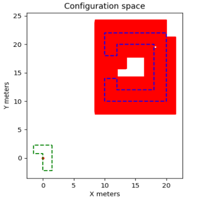

# Boundary Generation

## Environment 
* Boundary generation occurs in the `environment` class within `src/boundary_detection.py` 
* The class works by setting an ego agent (the pupper), adding each detected fiducial as an obstacle, and if a fiducial with `id = 0` was detected then a goal object is added to the class as well
* Obstacle locations are updated if a fiducial with an existing `id` is detected and obstacle locations can be cleared with `clear_obstacles`
* Then a list of boundaries corresponding to each obstacle is created using the [Minkowski Sum](https en.wikipedia.org/wiki/Minkowski_addition) formula

## Configuration Space
* Configuration space is essentially a series of points that represent infeasible locations and rotations for a robot in an environment
* We can use this along with discretization to generate a graph of all the feasible locations for the pupper robot in an environment with obstacls, assuming we have the models for the agent and the obstacles
* Below are two example configuration spaces shown in red for an ego agent in green for the obstacle in blue, notice how the configuration spaces changes when the rotation of the agent changes

 

