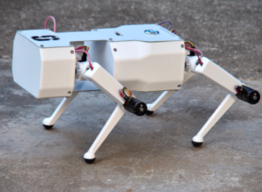

# Introduction

## Context
The Pupper project uses the Stanford Pupper 2.0 which does not currently have public documentation but information on the original Pupper project can be found at [Stanford Pupper](https://stanfordstudentrobotics.org/pupper). More detailed documentation on the original Pupper can be found at [Pupper Docs](https://pupper.readthedocs.io/en/latest/). This project explores topics related to fiducial detection, boundary generation, motion planning, controls, and hardware.

