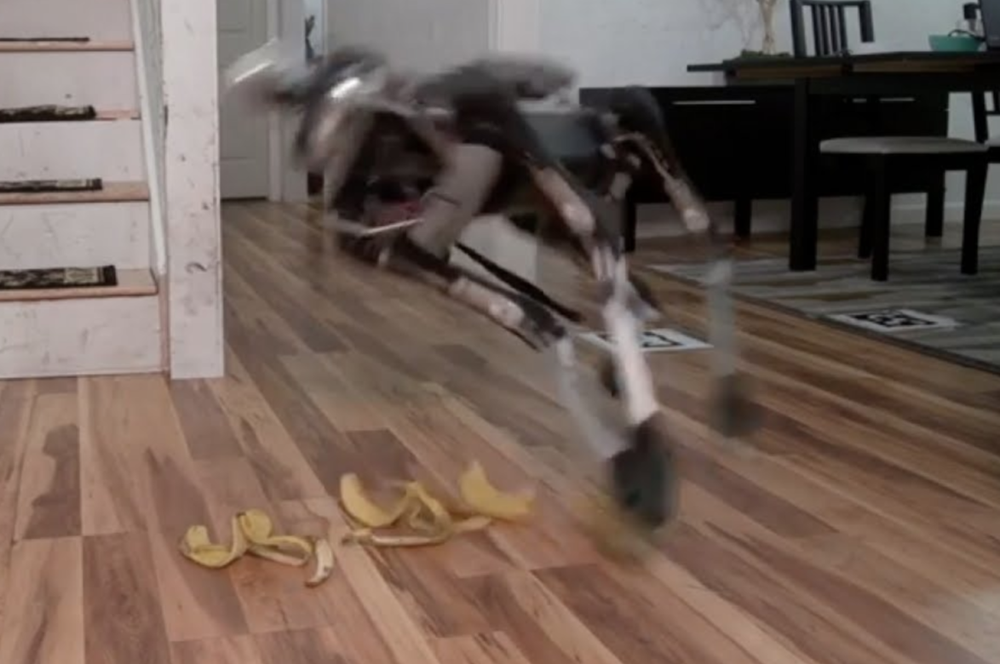
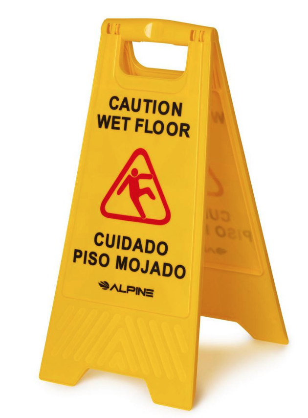
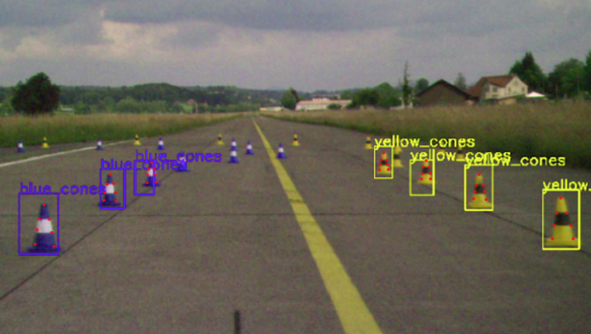
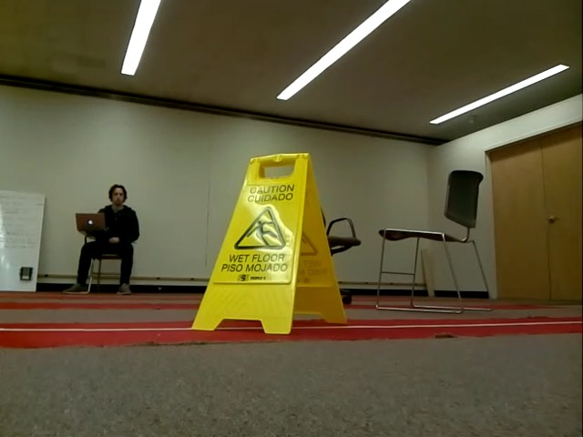

# Danger Signs

## Author: Matthew Millendorf 

### Section 1 - Introduction: 

Object avoidance is of the upmost importance for autonomous robotics applications. From autonomous vehicles to distribution center robots, the ability to avoid collisions is essentially to any successful robotics system. Our inspiration for this project came from the idea that the current Campus Rover significantly lacks semantic scene understanding. One type of scenes of particular concern are those that pose immediate danger to the robot. 
A possible scenarios is the campus rover is delivering a package and is moving along the hallway. The floor is wet and the robot is unable to understand the meaning of the yellow wet floor sign. The robot’s navigation system avoids the wet floor sign, but the radius of the water spill is greater than the width of the wet floor sign, and the robot’s wheels hit the water puddle. There is a staircase adjacent to this spill and when the robot’s wheels make contact with water, it spirals sideways, crashing down the stairs, breaking several of its components and the contents of the package. Our aim in this project is to provide a way for robots to avoid these scenarios through recognition of the trademark wet floor signs. 
The following report will go as follows. In section II, we will dive into relevant literature concerning our problem. Following that, we will detail our process and the difficulties we faced. Finally, in Section IV, we will provide a reflection of how our project went. 

 

### Section 2 - Relevant Literature:

The use of deep convolutional neural networks has enjoyed unprecedented success over the past decade in applications everywhere from facial recognition to autonomous navigation in vehicles. Thus, it seemed appropriate for our project that such techniques would be optimal. We decided our best methodology for allowing a robot to ‘understand’ a wet floor sign was to train a deep convolutional neural network on images of a yellow wet floor sign. 
Upon further research of this problem statement and methodology, we discovered a research paper from ETH Zurich that seemed to best fit our needs. The paper, written in 2018, details how ETH Zurich’s Autonomous Formula One Racing Team computes the 3D pose of the traffic cones lining the track. Although we only have about six weeks to complete our project, we ambitiously set out to replicate their results. We would take their methodology and apply it to our wet floor sign problem.
Their methodology consisted of three main phases. Phase 1 would be to perform object detection on a frame inputted from the racing car’s camera and output the 2D location of the traffic cone. We specify 2D because it is important to note that detection of obstacles in an image frame consists not of two coordinates, but of three. In this first phase, the researchers from ETH Zurich were only concerned with the computation of the location of bounding boxes around the cone within the frame. The output of this model would provide a probability that the detected bounding box contains a cone and what the x- and y-coordinates of the bounding box were in the image frame. 
The neural network architecture employed by the researchers was the YoloV3 architecture. Additionally, the researches trained this network on 2,000 frames labelled with the bounding box coordinates around the cones. 
In the second phase of the paper, a neural network was trained to regress the location of key points of the cones. For instance, the input to this network was the cropped bounding box region of where a cone was in the frame. This cropped image was then labelled with ‘key points’, specific locations on the cone that the second neural network would be trained. 
From there, once we have at least four points on the cone, knowing the geometry of the cone and calibration of the camera, the perspective n-points can be used to find the 3D pose of the cone. 

### Section 3 - Our Process:

Using the research paper as our guidelines, we set out to replicate their results. First came building the dataset that would be used for training both of our neural networks. We needed a yellow wet floor sign so we took one from a bathroom in Rabb. Over the course of two weeks, we teleoperated a Turtlebot3 around various indoor environments, driving it into the yellow wet floor sign, recording the camera data. 
From there, we labelled over 2,000 frames, placing bounding boxes around the yellow wet floor sign. This was by far the most tedious process we faced. From there, we needed to find a way to train a neural network to generalize on new frames. Upon further research, we came across a GitHub repository that was an implementation of the Yolov3 architecture in Keras and Python. There was quite a bit of configuration but we eventually were able to clone the repository onto our local machines and pass our data through it. 
However, the passing of data through our network required a significant amount of computation, and hence, we encountered our first roadblock. Needing a computer with greater computational resources, we turned to the Google Cloud Platform. We created a new account and were given a trial $300 in cloud credits. We created a virtual machine that we added two P100 GPUs. Graphic processing units are processors specifically made for rendering graphics. Although we were not rendering graphics, GPUs are used to processing tensors and thus, would perform the tensor and matrix computations at each node of the neural network with greater speed than standard central processing units. Once we trained a model to recognize the yellow wet floor signs, we turned our attention over to the infrastructure side of our project. This decision to focus on incremental steps proved to be our best decision yet as this was the aspect of our project with the most amount of bottlenecks. 
When trying to create our program, we encountered several errors with using Keras in the ROS environment. Notorious to debug, there were several errors within the compilation and execution of the training of the neural network that were impossible to solve after a couple weeks of figuring it out. We pivoted once again, starting from scratch and training a new implementation of the Yolov3 architecture. However, this repository was written in Pytorch, an API for deep learning that was more compatible with the ROS environment.
Despite these efforts, we still had trouble, coming across a slew of errors related to our integration of the neural network within our ROS environment. Once more, we created a solution. However, this solution was no longer optimal and we unfortunately can’t say our application runs in real time. Nevertheless, we are able to make predictions. 

### Section 4 - Reflection 

