# Gestures

## Author: Tirtho Aungon and Jade Garisch 

# Part 1: Kinect aka libfreenect2 

#### **Intro**

In Kinect.md, the previous generations dicussed the prospects and limitations of using a Kinect camera. We attempted to use the new Kinect camera v2, which was released in 2014. 

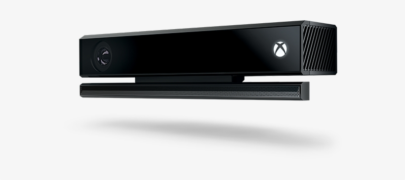 

Thus, we used the libfreenect2 package to download all the appropiate files to get the raw image output on our Windows. The following link includes instructions on how to install it all properly onto a Linux OS. 

https://github.com/OpenKinect/libfreenect2

### **Issues**

We ran into a lot of issues whilst trying to install the drivers, and it took about two weeks to even get the libfreenect2 drivers to work. The driver is able to support RGB image transfer, IR and depth image transfer, and registration of RGB and depth images. Here were some essential steps in debugging, and recommendations if you have the ideal hardware set up: 

- Even though it says optional, I say download OpenCL, under the "Other" option to correspond to Ubuntu 18.04+ 
- If your PC has a Nvidia GPU, even better, I think that's the main reason I got libfreenect to work on my laptop as I had a GPU that was powerful enough to support depth processing (which was one of the main issues) 
- Be sure to install CUDA for your Nvidia GPU 
- Install OpenNI2 if possible 
- Make sure you build in the right location 

Please look through this for common errors: 

 https://github.com/OpenKinect/libfreenect2/wiki/Troubleshooting 
 
 Although we got libfreenect2 to work and got the classifier model to locally work, we were unable to connect the two together. What this meant is that although we could use already saved PNGs that we found via a Kaggle database (that our pre-trained model used) and have the ML model process those gestures, we could not get the live, raw input of depth images from the kinect camera. We kept running into errors, especially an import error that could not read the freenect module. I think it is a solvable bug if there was time to explore it, so I also believe it should continued to be looked at. 
 
 However, also fair warning that it is difficult to mount on the campus rover, so I would just be aware of all the drawbacks with the kinect before choosing that as the primary hardware. 
 
 ### Database  
 
 https://www.kaggle.com/gti-upm/leapgestrecog/data 

### Machine Learning model 

https://github.com/filipefborba/HandRecognition/blob/master/project3/project3.ipynb

- What this model predicts: Predicted Thumb Down
Predicted Palm (H), Predicted L, Predicted Fist (H), Predicted Fist (V), Predicted Thumbs up, Predicted Index, Predicted OK, Predicted Palm (V), Predicted C

# Part 2: Leap Motion: Alternative approach (semi-successful one)  

## **Intro** 
 
 As a very last minute and spontaneous approach, we decided to use a Leap Motion device. Leap Motion uses an Orion SDK, two IR camerad and three infared LEDs. This is able to generate a roughly hemispherical area where the motions are tracked.
 

 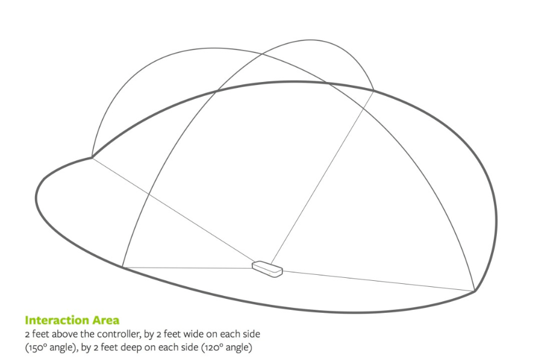
 
 
 
 

 
 It has a smaller observation area dn higher resolution of the device that differentiates the product from using a Kinect (which is more of whole body tracking in a large space). This localized apparatus makes it easier to just look for a hand and track those movements. 
 
 The set up is relatively simple and just involved downloading for the appropriate OS. In this case, Linux (x86 for a 32 bit Ubuntu system).  
 
 ## **Steps to downloading Leap Motion and getting it started:**
 
 1. download the SDK from https://www.leapmotion.com/setup/linux; you can extract this package and you will find two DEB files that can be installed on Ubuntu.
2. Open Terminal on the extracted location and install the DEB file using the following command (for 64-bit PCs):

 	**$ sudo dpkg -install Leap-*-x64.deb** 
 	
 	**If you are installing it on a 32-bit PC, you can use the following command:**
 	
	**sudo dpkg -install Leap-*-x86.deb**
	
3. plug in leap motion and type dmesg in terminal to see if it is detected

4. clone ros drivers:   

    **$ git clone https://github.com/ros-drivers/leap_motion**

5. edit .bashrc:

    **export LEAP_SDK=$LEAP_SDK:$HOME/LeapSDK**
    
    **export PYTHONPATH=$PYTHONPATH:$HOME/LeapSDK/lib:$HOME/LeapSDK/lib/x64**
6. save bashrc and restart terminal then run:

    **sudo cp $LeapSDK/lib/x86/libLeap.so /usr/local/lib**
    
    **sudo ldconfig**
    
    **catkin_make install --pkg leap_motion**

7. to test run:
 
    **sudo leapd**
 
    **roslaunch leap_motion sensor_sender.launch**
       
    **rostopic list**
    
Once having Leap Motion installed, we were able to simulate it on RViz. We decided to program our own motion controls based on angular and linear parameters (looking at directional and normal vectors that leap motion senses): 

This is what the Leap Motion sees (the raw info):

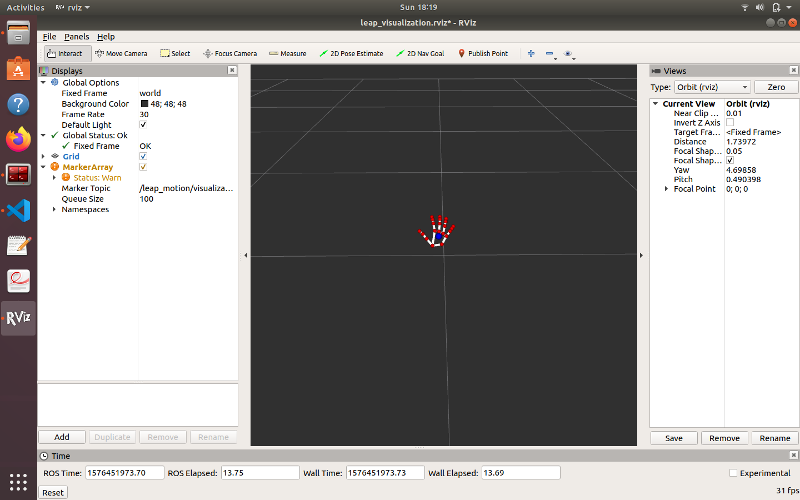

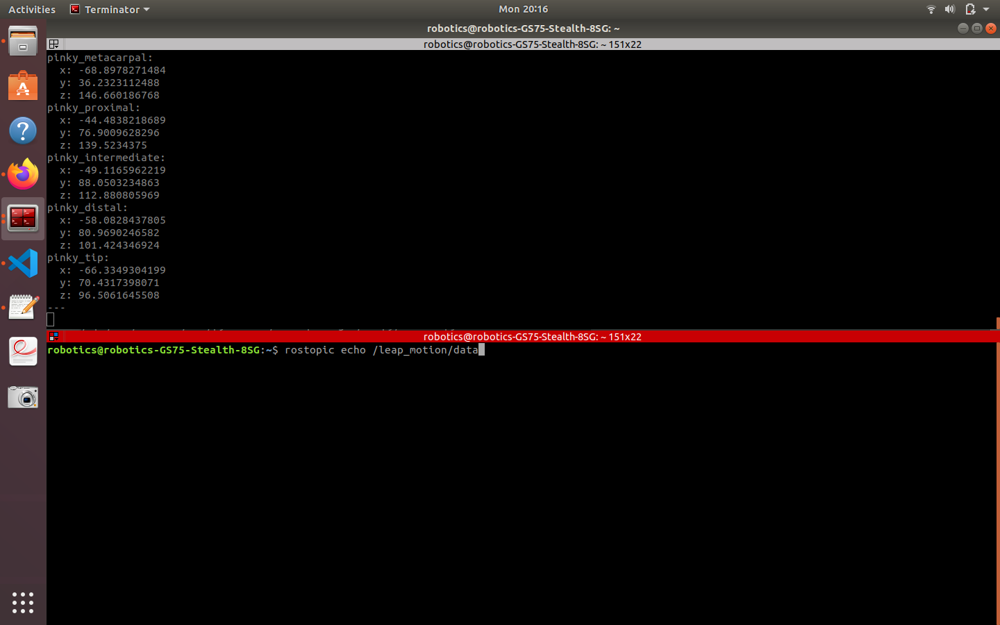

In the second image above, the x y and z parameters indicate where the leap motion detects a hand (pictured in the first photo)

**This is how the hand gestures looked relative to the robot's motion:** 

### **Stationary** 
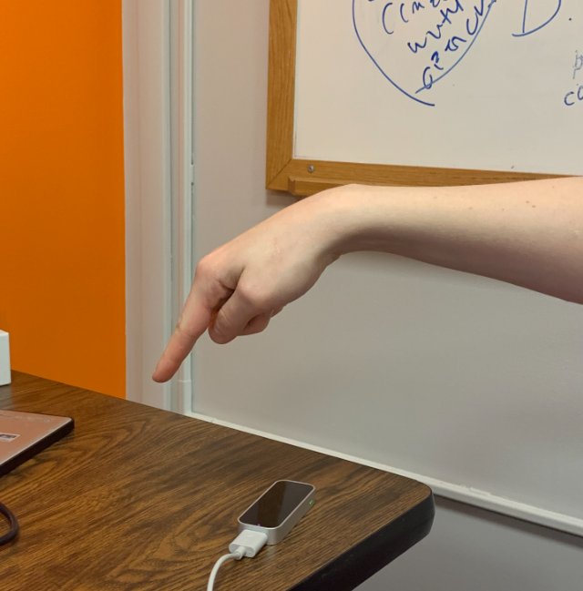

### **Forward** 

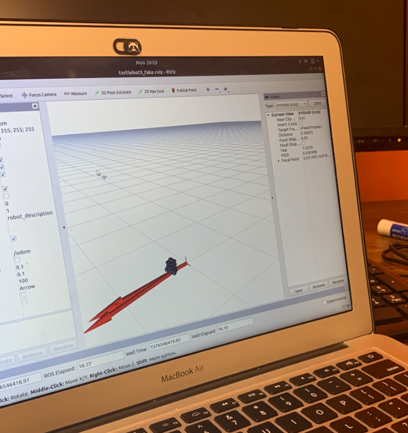

### **Backward** 

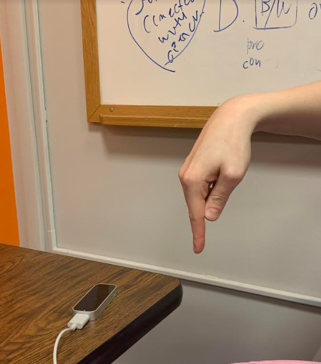

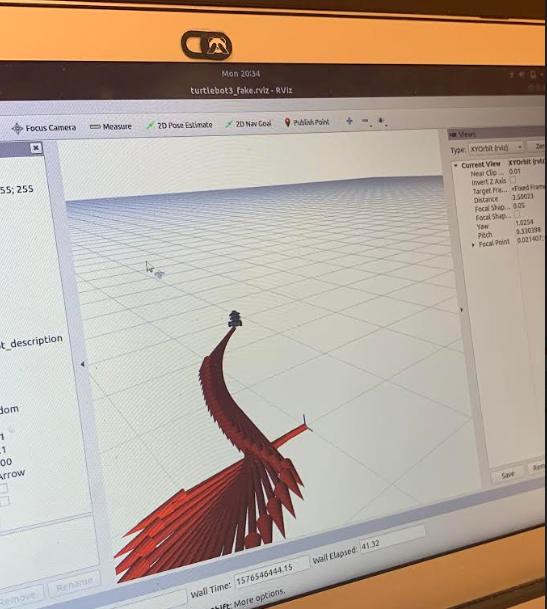

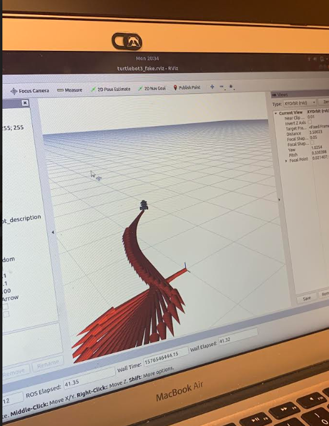

### **Left Rotation** 

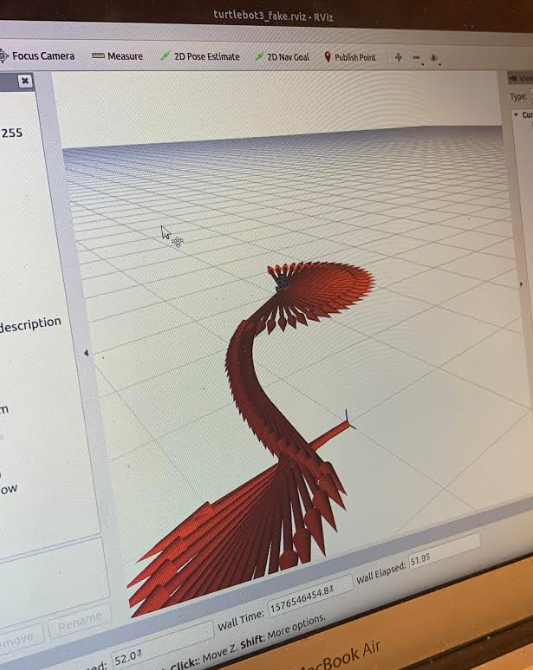

### **Right Rotation**

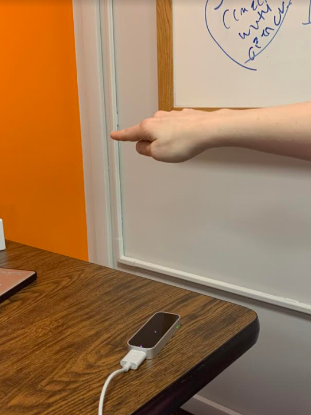

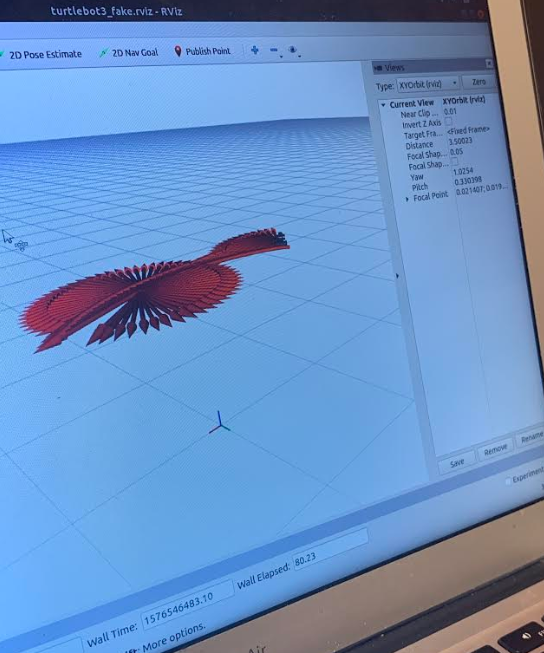

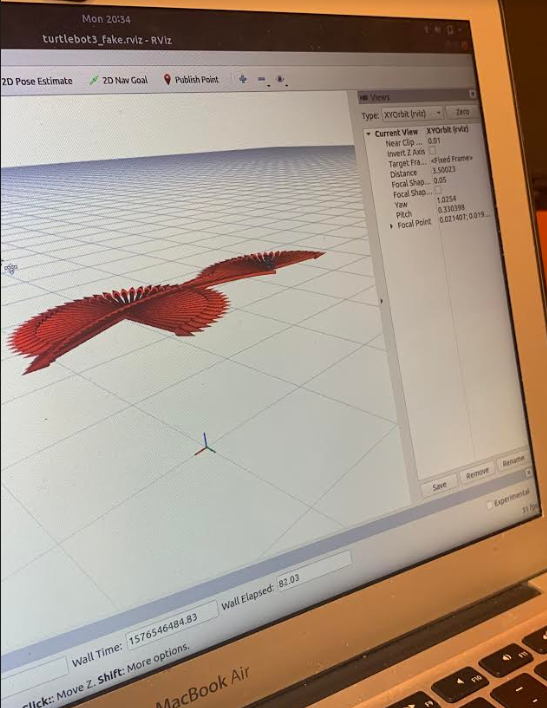

## **Conclusion**

So, we got the Leap Motion to successfully work and are able to have the robot follow our two designated motion. We could have done many more if we had discovered this solution earlier. One important thing to note is that at this moment we are not able to mount the Leap Motion onto the physical robot as LeapMotion is not supported by the Raspberry Pi (amd64). If we are able to obtain an Atomic Pi, this project should be able to be furthered explored. Leap Motion is a very powerful and accurate piece of technology that was much easier to work with than the Kinect, but I advise still exploring both options. 

