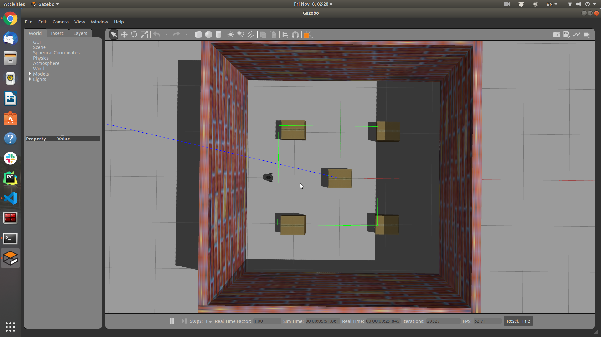
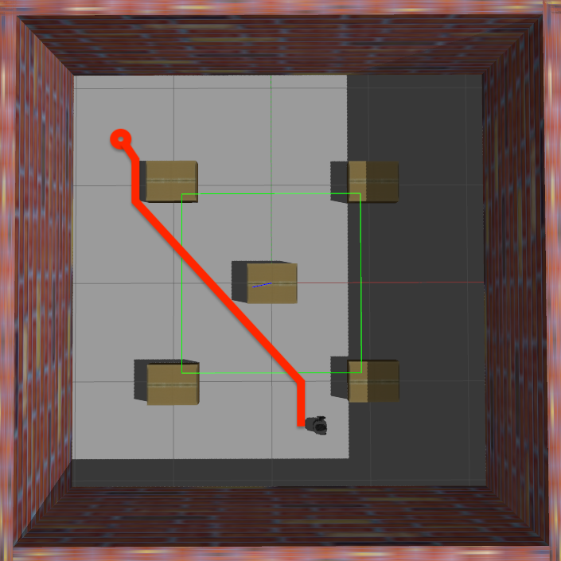
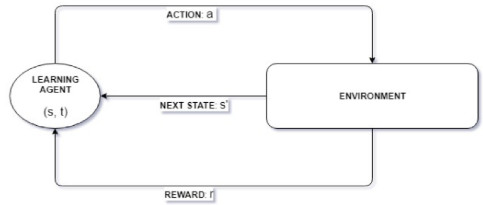
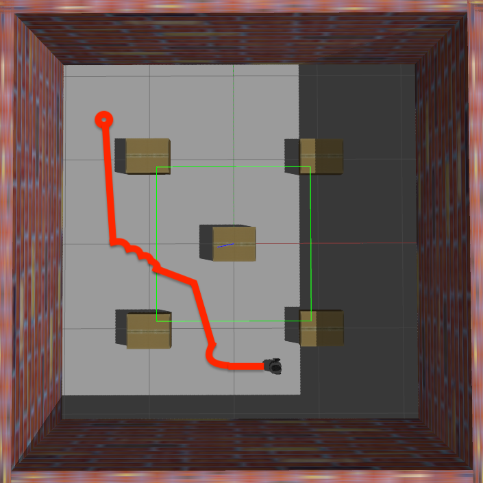
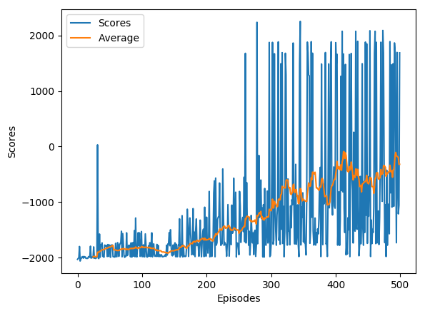
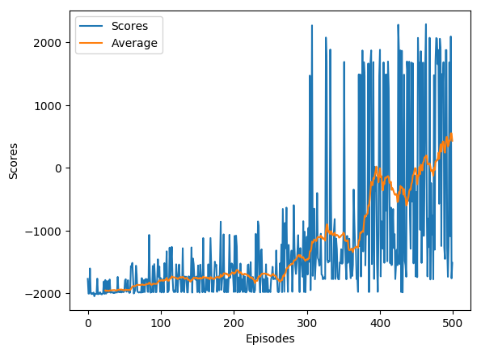
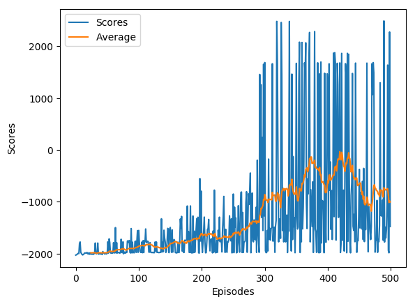
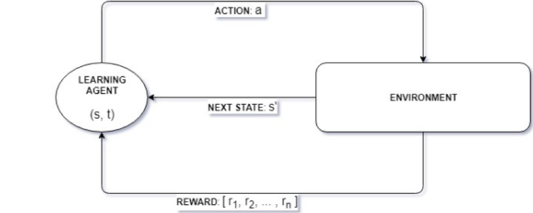

# Path Planning Scenarios

#### Github Link: https://github.com/DHDanielSuh/Path_Planning_with_QLearning
## Author: Daniel Suh

## Robot Path Finding using A Star Algorithm, Wave front Algorithm, and Reinforcement Learning.

   The current society considers robots as a crucial element. It is because they have substituted human beings concerning the daily functions, which could be dangerous or essential. Therefore, the designation of an effective technique of navigation for robots that can achieve mobility as well as making sure that they are secure is the crucial considerations related to autonomous robotics. The report, therefore, addresses the pathfinding in robots using A-Star Algorithm, Wavefront Algorithm, as well as using Reinforcement Learning. The primary aim of path planning in robotics is to establish safe paths for the robots that can achieve mobility. The preparation of routes in robotics should achieve optimality. These algorithms target the development of strategies that are intended to provide solutions to problems like the ability of a robot to detect the distance between objects that causes obstructions, techniques of evading the obstacles, as well as how to achieve mobility between two elements of blockage in the shortest possible path. Moreover, the project is meant to help in coming up with the shortest route, if possible, that the Robot can use to reach the destination.

   When carrying out the project, there were a lot of resources, even though some were not directly addressing the issues, and I was able to get numerous information that helped in connecting the points and getting the right idea. Apart from the readily available internet sources, I as well-referred to several related papers, Professor Sutton's book, and Professor David Silver's lecture.

### What was created?

   A two-dimensional environment where the robot training was to be undertaken was created. The atmosphere was made in such a way that for the Robot to finds its path from location A to B, there are several obstacles, destructions, and walls that would hinder it from getting to the destination. The result would be to identify how the Robot would meander through the barriers to reach the desired position. A robot sensor was used to help the robot to perceive the environment. To determine the best way of path determination, the following criteria were utilized, A star Algorithm and Wavefront Algorithm and Reinforcement Learning.

#### A Star Algorithm

   The technique is a crucial way of traversal of graphs and pathfinding. It has brains, unlike other traversal strategies and algorithms. The method can be efficiently adopted into ensuring that the shortest path is efficiently established. It is regarded as one of the most successful search algorithms, which are the best to be used to find the most concise way in the graphs and notes. The Algorithm uses heuristics to find the solution paths as well as the information concerning the path cost to come up with the best and shortest route. In this project, the use of the A-star Algorithm would be necessary for that it would help in the determination of the shortest path that can be used by the Robot to reach the destination. In working places or any other environment, we always look for the shortest routes which we can use to reach the target. The Robot was designed using this Algorithm, which helps in the productive interaction with the environment to find out the best paths that can be used to reach the destination. An example of an equation that shows this form algorithm is f(n) = g(n) + h(n) in which f(n) is the lowest cost in the node, g(n) is the exact cost of the path and h(n) the heuristic estimated cost from a node.

Path MAP

#### Wave front Algorithm

   To make it more efficient and more tactical, the wavefront algorithm was utilized to help in determining the correct path that can be used by the Robot to reach the destination effectively. This type of Algorithm is regarded as a cell decomposition path method. When the workplace paths are divided into equal segments, getting the right paths can always be an issue; however, using this Algorithm will help to come up with the correct way that can easily use by the Robot in reaching the destination. The method uses the breadth-first search based on the position in which the target is. The nodes in this method are increasingly assigned values from the target note. At sometimes, the modified wavefront algorithm would be suggested in future research to come up with the best estimate of the path that is needed to be followed. The improved version of the system as well uses the notes; nevertheless, it provides for the most accurate results. In this project, for the remote censored Robot to find the correct path to reach the target faster, the wavefront algorithm was utilized.

   In the allocation of the nodes, the following equation holds!

   Map (i,j) = {min (neighborhood (i j)) + 4 [empty diagonal cell]/ min (neighborhood (i j)) + 3 other empty  cell obstacle cell]

   The equation in shows the allocation of the nodes with reference to the coordinates (i,j). The algorithm thus provides a solution if it exists incompleteness and provides the best solution.

Path MAP

#### Deep Learning Reinforcement in Path Findings

   To ensure that the Robot is adequately trained on the environment to determine the best path that can quickly and faster lead to the target, a deep reinforcement algorithm will be necessary. The reinforcement algorithm will, therefore, be the component that will majorly control the Robot in the environment. For instance, the Algorithm will be planted on the Robot to help in avoiding the obstructions such that when the Robot is about to hit an obstacle, it will quickly sense the obstacle and change the direction but leading to the target. Moreover, deep learning with help the Robot to get used to the environment of operation. It is said that the Robot is as well able to master the path through the deep learning inclusions. Still and moving obstacles can only be determined and evaded by the Robot through the use of deep learning, which can help the Robot to recognize the objects. In general, one way to make the Robot to find the path of operating effectively and to work in the environment effectively is to involve deep learning in this operation. To improve the artificial intelligence of the system, a deep learning algorithm will be of importance. 

   𝑄ˆ(𝑠, 𝑎) = (1 − 𝛼𝑡). 𝑄ˆ(𝑠, 𝑎) + 𝛼𝑡(𝑟 + 𝛾 max 𝑎 ′ 𝑄ˆ(𝑠 ′ , 𝑎′ ))

   Figure portrays the single target fortification learning system. Where the specialist, spoke to by an oval, is in the state (s) at time step (t). The operator plays out the activity-dependent on the Q-esteem. The earth gets this activity, and accordingly, it restores the following states' to the operator and a comparing reward (r) for making a move (a). 

Path MAP

##### Training Result Difference between Learning Rate

Learning Rate = 0.0001, Batch Size = 200

###### Best Model

Learning Rate = 0.0002, Batch Size = 200 

Learning Rate = 0.0003, Batch Size = 200

Learning Rate = 0.0004, Batch Size = 200

#### Double q learning

   In most cases, in a system which is a bit complex, the deep reinforcement learning may not be the best option but, one can decide to go by the deep double q learning which is embedded by Q-matrix which is being advanced to help in finding the paths in very complicated places. Moreover, when the Robot is to be operated in a large environment, it may take time for the deep reinforcement learning to help in getting the correct codes; thus, the use of double Q learning should be an option. It is in this manner recommended that in the next projects, there can be the use of this system to get more harmonized results.

   𝑉 𝜋 (𝑠) = 𝐸{ ∑︁∞ 𝑘=0 𝛾 𝑘 𝑟𝑡+𝑘+1|𝑠𝑡 = 𝑠}

   As opposed to Q learning, the Double Q learning equation is vectorial functions.

   The figure portrays the multi-objective reinforcements support learning structure. Like the single goal RL system, in MORL structure, the operator is spoken to by an oval and is in the state (s) at time step (t). The specialist makes a move dependent on the accessible Q-values. The earth gets this activity, and accordingly, it restores the following state s' to the specialist.

### Process & Problem

   In the early days, there were many concerns about how to proceed with this project. I wanted to study how to find something new rather than simply applying an existing path algorithm to the robot. I also considered a model called GAN, but decided to implement reinforcement learning, realizing that it was impossible to generate as many path images as to train GAN. The biggest problem with implementing reinforcement learning was computing power. Reinforcement learning caused the computer's memory to soar to 100 percent and crash. I tried and ran several options, but to no avail, I decided to reinstall Ubuntu. After the reinstallation, I don't know why, but it's no longer to a computer crash due to a sharp rise in memory. Currently, even with a lot of repetitive learning, it does not exceed 10% of memory.

   Another problem with reinforcement learning was the difficulty in adjusting hyperparameters. Since reinforcement learning is a model that is highly influenced by hyperparameters, it was necessary to make fine adjustments to maximize performance. Initially, the code did not include grid search, but added a grid search function to compare hyperparameters. It took about six hours to get around 500 epochs, so I didn't experiment with a huge variety of hyperparameters. However, after three consecutive weeks of training, I found the best performing hyperparameters.

   The third problem with reinforcement learning was that the results of learning were not very satisfactory. According to various papers, existing Deep Q Learning can be overestimate because same Q is used. Therefore, although it has not been fully applied to the code yet, I will apply Double Q Learning and Dueling Network in the near future.

### Conclusion

   In conclusion, it gets imperative to note the issue of path findings in the intelligence machine has been long in existence. Nevertheless, through these methods, the correct paths can be gotten, which is short but can help the Robot in reaching the target.

### References
Mnih, Volodymyr, et al. "Human-level control through deep reinforcement learning." Nature 518.7540 (2015): 529.

Mnih, Volodymyr, et al. "Playing atari with deep reinforcement learning." arXiv preprint arXiv:1312.5602 (2013). https://arxiv.org/abs/1312.5602

Nuin, Yue Leire Erro, et al. "ROS2Learn: a reinforcement learning framework for ROS 2." arXiv preprint arXiv:1903.06282 (2019). https://arxiv.org/abs/1903.06282

Van Hasselt, Hado, Arthur Guez, and David Silver. "Deep reinforcement learning with double q-learning." Thirtieth AAAI conference on artificial intelligence. 2016. https://www.aaai.org/ocs/index.php/AAAI/AAAI16/paper/viewPaper/12389
