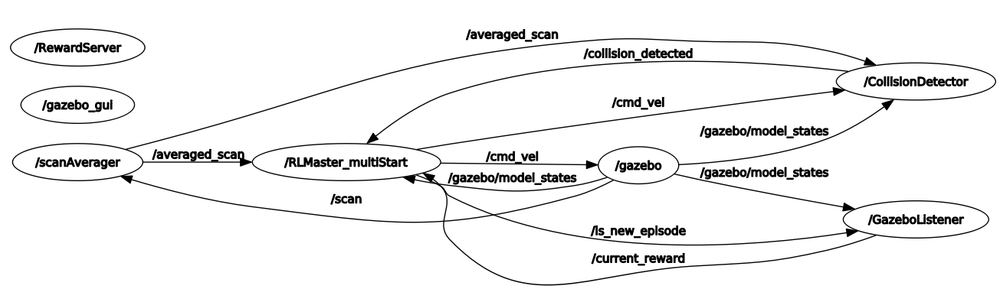
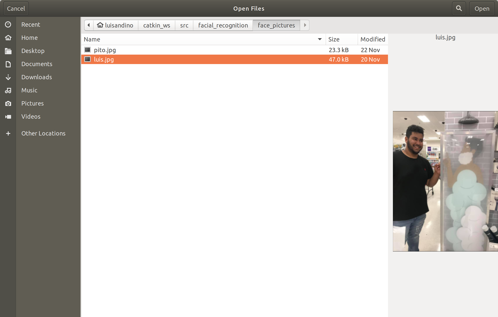
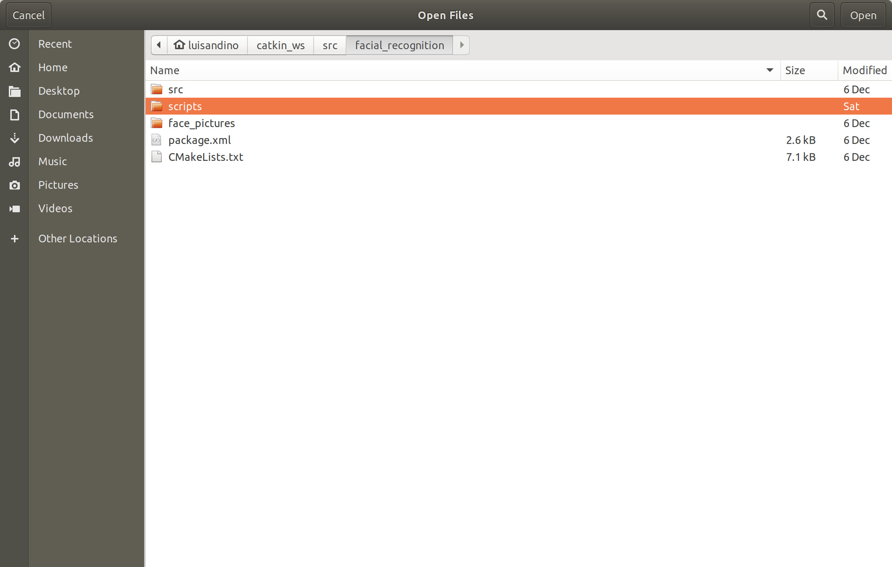
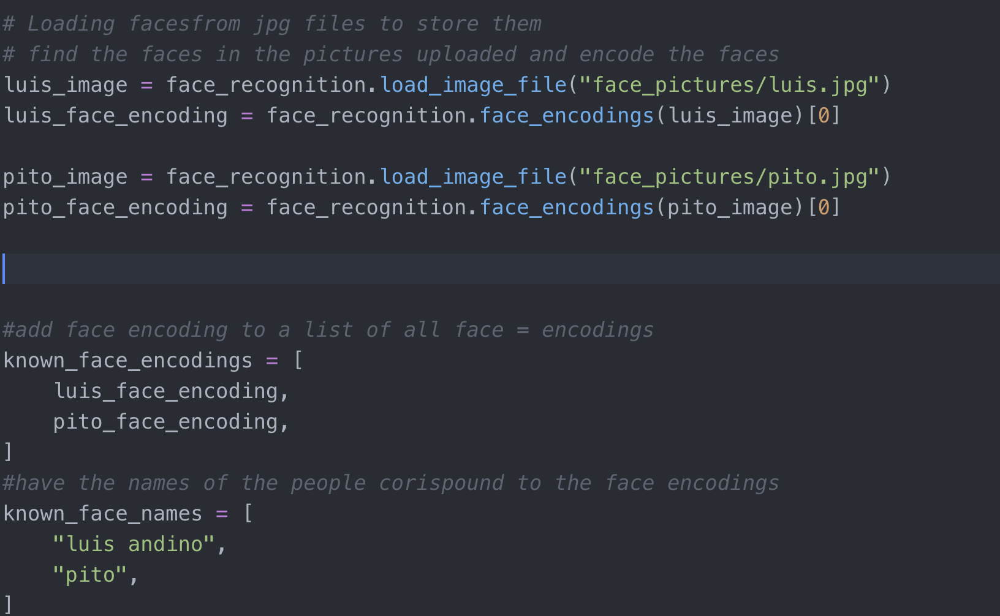
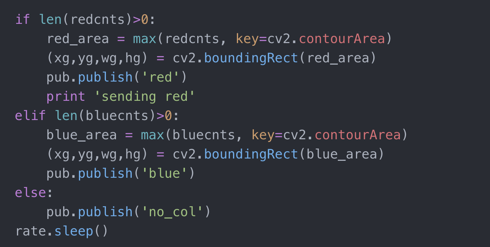

# Reinforcement Learning Racer
## Author: Luis Andino & Ben Ballintyn

 ### Introduction

In this project, we proposed to use deep learning methods to accomplish two tasks. 1. To navigate the robot throughout a racecourse using LIDAR data only and 2. To recognize certain signs (stop, go) and act accordingly. For the first objective, we implemented 2 deep reinforcement learning algorithms (Deep Deterministic Policy Gradient and Soft Actor-Critic) to try and learn to map LIDAR sensor data to appropriate actions (linear and angular velocities). We intended to train these algorithms on multiple simulated race tracks in the Gazebo simulation environment and if possible deploy the trained network on a real-world robot. For the second objective, we adapted existing computer vision models to recognize hazard signs like stop, yield, go, and caution. The last of our original objectives was to implement a facial recognition algorithm to work with the TurtleBot 3 architecture and hardware constraints.

### Relevant literature 

Deep reinforcement learning is a family of techniques that utilizes deep neural networks to approximate either a state-action value function (mapping state-action pairs to values) or a state directly to action probabilities (known as policy-gradient methods). In this project, we implemented and tested two Deep RL algorithms. The first is the DDPG agent first proposed by DeepMind [^1]. To help in understanding and implementing this algorithm we also found a very helpful blog post [^2] and associated PyTorch implementation of the DDPG agent. The second algorithm implemented was the Soft Actor-Critic agent proposed by Haarnoja et al. from the University of California Berkeley [^3]. Again, a blog post was very helpful in understanding the agent and provided a PyTorch implementation [^4].

The computer vision components, there was a mixture of GitHub repositories, Open-CV tutorials and a blog post posted on analyticsvidhya, written by Aman Goel. The analyticsvidhya blog post helped me to understand the facial_recognition library in python and how to properly implement it[^5]. The GitHub repository that was used as a reference for the proof of concept implementation that was done on Mac OS was written by Adam Geitgey, who is the author of the facial recognition python library[^6]. His Github repository along with his README helped me understand how the algorithm works and how to latter modify it within an ROS environment.

There was an assortment of ROS wiki articles used to troubleshoot and understand the errors that were occurring with OpenCV reading the data that was coming from the TurtleBot 3. The wiki articles lead me to the cv_bridege ROS package that can convert a ROS compressed image topic to an OpenCV format[^7].

[^1]: Lillicrap et al., 2015. Continuous control with deep reinforcement learning https://arxiv.org/pdf/1509.02971.pdf

[^2]: Chris Yoon. Deep Deterministic Policy Gradients Explained. https://towardsdatascience.com/deep-deterministic-policy-gradients-explained-2d94655a9b7b

[^3]: Haarnoja et al., 2018. Soft Actor-Critic: Off-Policy Maximum Entropy Deep Reinforcement Learning with a Stochastic Actor. https://arxiv.org/abs/1801.01290 

[^4]: Vaishak V. Kumar. Soft Actor-Critic Demystified. https://towardsdatascience.com/soft-actor-critic-demystified-b8427df61665

[^5]: Blog, Guest. “A Simple Introduction to Facial Recognition (with Python Codes).” Analytics Vidhya, May 7, 2019. https://www.analyticsvidhya.com/blog/2018/08/a-simple-introduction-to-facial-recognition-with-python-codes/.

[^6]: Geitgey, Adam, Facial Recognition, GitHub Repository https://github.com/ageitgey/face_recognition 

[^7]: “Wiki.” ros.org. Accessed December 13, 2019. http://wiki.ros.org/cv_bridge/Tutorials/UsingCvBridgeToConvertBetweenROSImagesAndOpenCVImages.

[^8]: PyPI. (2019). face_recognition. [online] Available at: https://pypi.org/project/face_recognition/ [Accessed 16 Dec. 2019].

### Technical descriptions, illustrations

For the driving component of this project, the first step was to create a racetrack to simulate the robot on. To do this, I used Gazebo’s building editor to create a racecourse out of straight wall pieces (there are no default curved pieces in Gazebo). Creating the course (seen in Figure 1) involved saving a .sdf file from gazebo inside the turtlebot3_gazebo/models folder, a .worlds file in turtlebot3_gazebo/world, and a launch file in turtlebot3_gazebo/launch. The initial goal was to train the agent to drive counter-clockwise around the track as fast as possible. To do this, I implemented 5 types of nodes to carry out the different parts of the canonical RL loop (Figure 2) and manually chose 31 points around the track as “checkpoints” to monitor the robot’s progress within a training episode. How close the agent is to the next checkpoint is monitored from timestep to timestep and is used to compute the rewards used to train the agent.

This tracking of the robot’s ground truth position in the track is done by a node called GazeboListener.py which subscribes to Gazebo’s  /gazebo/model_states topic. This node also requested reward values from a service called RewardServer.py every 100ms and published them to a topic called /current_reward. These rewards are the critical instructive component of the canonical RL loop as they instruct the agent as to which actions are good or bad in which situations. For this project, the “state” was the average of the past 5 LIDAR scans. This averaging was done in order to smooth out the relatively noisy LIDAR readings. The LIDAR smoothing was implemented by a node called scanAverager.py which subscribed to /scan and published to /averaged_scan. 

To choose the actions, I made minor alterations to the PyTorch implementations of the DDPG or SAC agents given by [2,4]. This involved wrapping PyTorch neural network code in class files myRLclasses/models.py and myRLclasses/SACmodels.py. I then wrapped the logic for simulating these agents in the Gazebo track in a ROS node called RLMaster_multistart.py which handled action selection, sending cmd_vel commands, storing experience in the agent’s replay buffer, and resetting the robot’s position when a collision with a wall was detected (end of an episode). These collisions actually proved difficult to detect given the minimum range of the robot’s LIDAR (which is larger than the distance to the edge of the robot). Therefore I said there was a collision if 1) the minimum distance in the LIDAR scan was < .024M, 2) the actual velocity of the robot differed significantly (above a threshold) then the velocity sent to the robot (which in practice happened a lot), and 3) the actual velocity of the robot was less than .05M/s. This combination of criteria, in general, provided relatively robust collision detection and was implemented in a node called CollisionDetector.py.

Having implemented the necessary nodes, I then began training the robot to drive. My initial approach was to have every training episode start at the beginning of the track (having the episode ends when the robot crashed into a wall). However, I found that this caused the robot to overfit this first corner and be unable to learn to make the appropriate turn after this corner. Therefore, I switched to a strategy where the robot would start at a randomly chosen checkpoint for 10 consecutive episodes and then a different randomly chosen checkpoint would be used for the next 10 episodes and so on. This allowed the robot to gain experience with the whole track even if it struggled on particular parts of it. Every timestep, the current “state” (/averaged_scan) was fed into the “actor” network of the DDPG agent which would emit a 2D action (linear velocity and angular velocity). I would then clip the action values to be in the allowable range (-.22 - .22 for linear velocity and -.5 to .5 for angular velocity). Then, noise generated by an Ornstein-Uhlenbeck process would be added to these clipped actions. This added noise provides the exploration for the DDPG model. For the SAC agent, no noise is added to the actions as the SAC agent explicitly is designed to learn a stochastic policy (as opposed to the deep **deterministic **policy gradient). This noisy action would then be sent as cmd_vel commands to the robot. The subsequent timestep, a new state (scan) would be observed and the resulting reward from the prior timestep’s action would be computed. Then the prior scan, the chosen action, the subsequent scan, and the resulting reward would be pushed as an “experience tuple” into the DDPG agent’s memory replay buffer which is implemented as a deque. This replay buffer (stored in myRLclasses/utils.py) holds up to 500,000 such tuples to provide a large body of data for training. At the end of each timestep, a single batch update to all of the agent’s networks would be carried out, usually with a batch_size of 1024 experience tuples. Additionally, every 50 episodes I would do 1000 network updates and then save the agent as a .pkl file.

Finally, I wrote a node to allow a human to control the robot using teleop controls and save the experience in the agent’s replay buffer. This was in the hope that giving the agent experience generated by a human would accelerate the learning process. This was implemented by a node called StoreHumanData.py. 

The facial recognition aspect of the RL Racer project took different python techniques and converted and optimized it to work with ROS. There is no launch file for this program. To run this program, you must first have the TurtleBot 3 and have brought up the camera software and have your facial_ recognition as the current directory in terminal. The command to run the code is as follows: $rosrun facial_recognition find_face.py

To do this we had to fundamentally rethink the program structure and methods for it to work. The first thing we had to contend with was the file structure while running the program through ROS, which you can see in figure 4 and figure 5. This was just a little quirk while working with ROS as compared to Python. While running the program you have to be directly in the Facial_recognition folder, anywhere else would result in a “file not found” error while trying to access the images. The Alternative to having to be in the folder for this to work, was to have all the images in the same “scripts” folder, which made for messy “Scripts” and made it confusing while adding new photos.

{ width=50% } 

The steps for adding a photo are as simple as adding to the “face_pcitures” directory as shown figure 6. The image should have a clear view of the face you want the algorithm to recognize. The image does not have to be a giant picture of just a face.  After you add an image to the file path you have to package you must call “load_image_file”, which will load the image. The next step is to encode the loaded image and find the face in the image. To do this you must all the “face_encodings” method in the facial_recognition package and pass the image you have loaded as an argument.  After the images are added and encoded you add the facial encoding to a list and add the names to a list of names of type String of the people in the list in order. Since Luis is the first face that was added to the prior list, then it will be the first name in the list of names. This is the implementation of the node version of facial recognition that constantly publishes the names of faces that it finds, but there is also a service implementation.

 

The major difference between the service implementation is the segmentation of the image callback and image processing as you can see in figure 7.  We keep track of the frame in a global variable called frame that can be later accessed. We also need the name of the person to be passed and we only process the next 20 frames and if we don’t see the person requested, we will send no. This also is reinforced with a suggested control request implementation.

 

The color recognition and control node came from a desire to define hazards. There was also a need to still follow other rules while training the neural net and to keep other factors in mind. This uses the basics of OpenCV to create color masks that you can put a specific RGB value you want to pick up. To run the program, you need to run python files in two separate windows. The first command is $ rosrun facial_ recognition racecar_signal.py The second command is: $ rosrun faical_recognition red_light_green_light.py. The racecar_signal node does all the image processing while the red_light_green_light node is a state machine that determines what to send over cmd_vel.

To add color ranges that you want to pick up you have to add the RGB ranges as NumPy arrays as seen in figure 8. After you manually add the RGB range or individual value you want to detect, you must create a find colors object based on the ranges. In this case, the ROS video image comes from the HSV variable. That was set whole converting the ROS Image to an OpenCV format.

 

### Discussion of interesting algorithms, modules, techniques

The two deep RL algorithms tried were the Deep Deterministic Policy Gradient (DDPG) and Soft Actor-Critic (SAC) agents. The major difference between these methods is that the DDPG is deterministic, that is it outputs a single action every timestep, whereas the SAC agent outputs the parameters of a probability distribution from which an action is drawn. In addition, the DDPG agent is trained simply to maximize reward, whereas the SAC agent also tries to maximize the “entropy” of its policy. Simply, it balances maximizing reward with a predefined amount of exploration. For the first few weeks of the project, I exclusively tried training the DDPG agent by playing around with different hyperparameters such as noise magnitude and batch size as well as tuning the collision detection. I found that the agent was able to make significant progress and at one point completed two full laps of the track. However, after leaving the agent to train overnight, I returned to find that its performance had almost completely deteriorated and was mostly moving backward, clearly a terrible strategy. After doing a little more reading on the DDPG I found that it is an inherently unstable algorithm in that it is not guaranteed to continually improve. This prompted me to look for an alternative deep RL algorithm that was not so brittle. This search led me to the SAC algorithm which was specifically said to be more robust and sample efficient. I again implemented this agent with help from a blog post and started tuning parameters and found that it took longer (almost 3500 episodes) to show any significant learning however it seems to be maintaining its learning better. I am unsure what the problem with my current training method is for the DDPG agent and suspect the problem may just be due to the brittleness of the algorithm. One possible change that could help both agents would be to average over the LIDAR readings (within one scan) to reduce the dimensionality of the input (currently 360 inputs) to the networks which should help reduce learning complexity at the cost of lower spatial resolution. Finally, an interesting behavior produced by both robots was that during straight parts of the course, they learned a strategy of alternating between full left and full right turn instead of no turn at all. It will be interesting to see if this strategy gets worked out over time or is an artifact of the simulation environment 

The facial_recognition package comes with a pre-built model that has a  99.38% accuracy rate and built-in methods for facial encoding and facial comparison[^8]. The algorithm takes the facial encodings from loaded images that can be manually added a given script and uses landmarks to encode the pictures face. Using OpenCV we take the frames from a given camera, the algorithm finds the faces in the frame, encodes them, then compares the captured data facial encodings. One of the main challenges that I faced while trying to optimize the algorithm further resulted in failure because I could not figure out how to increase the processing time of facial recognition. This was mostly to do with my computer, but there was also a concern of wifi image loss or just slow wifi. Since ROS compressed image is just a published topic published, which relies on wifi. I got around this by manually dropping frames. I tried ROS each way at first limiting the queue and adding sleep functions, but it causes some problems when trying to implement this with other nodes. These methods would just throughout the frames it would still wait within a queue and still have to be processed. To get around these limitations I hardcoded a counter to only take 1 every 6 frames that come in and process it. It is not ideal but it works. The service implementation does something similar as I only want to a total of 24 processed frames, but still following the 1 out of 6 frame method. In total even though I am being sent (6*24) =144, I am only processing 24 frames, but this only occurs when the desired face is not in the frame.

The sign detection of RL racer was supposed to feature real signs detection, but We ran into a problem finding models of American sign or even when we did we could not get it to run. This is why we went the color route and because we could not train a model in time. The control nodes and the color detection nodes all work, but we were never able to implement it into the RL racer because it took longer than expected to train racer. The theory of color detection is that we can mimic signs by using specific RGB values that we want the robot to pick up. So, Green would be Go, Red would be stopped, and Yellow would be a cushion. Obviously, this is to mimic traffic signals.

### Story of the project.

This project was very interesting and a lot of fun to work on, even though we had to pivot a few times in order to have a finished product. However, we still learned a lot and worked well together always talking, even though we had two distinct parts we wanted to get done in order to come together. Unfortunately, we could not bring everything together that we wanted we still accomplished a lot.

We were disappointed to learn just how unstable the DDPG agent was after initial success but are hopeful that the now operational SAC agent will be able to accomplish the task with more training.

The problem that my facial recognition aspect has is that you have to be within 3 feet for an algorithm to reliably tell who you are or if there is a face on screen. I tried a few things with resizing the image or even try to send uncompressed image topics, but it did not work. An interesting solution that we tried was if we can tell that there was a face there, but now who it was we could take the bounding box of the unknown face, cut it out because we knew where it was on the image, then zoom in. This approach did not work because the image was too low quality. 

We both did a good job of accomplishing what we wanted to, even though we had to pivot a few times. We believe that the code we implemented could be used in further projects. The deep RL code could be used to learn to drive around pre-gazeboed maps with some adaptation and the general method could be applied anywhere continuous control is needed. The facial recognition algorithm can be easily added to the code base of Campus Rover for package delivery authentication and any other facial recognition applications. 

### GitHub Link

[Reinforcement Learning Racer](https://github.com/landinojr/RL_Racer "GitHub RL"): 

