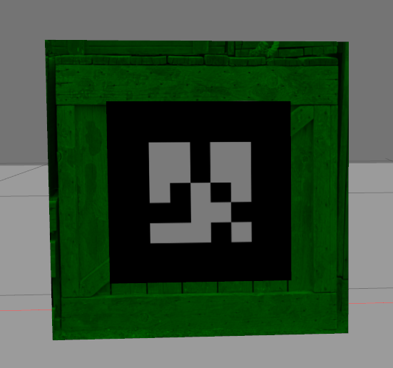
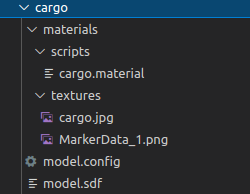

# Adding Texture

by Tongkai Zhang, tongkaizhang@brandeis.edu

This is a quick guide for adding textures(.png) to your model in gazebo.



## Prerequisite

- gazebo
- model in sdf format


## Texture Configuration

After building your own model in the sdf format, you should have a structured model `cargo`directory same as the one below.




It's important that you have the directory exactly the same, since importing the texture into gazebo is based on finding parameters and texture images within that directory.

- scripts: `cargo.material`, formatted file, defining the **name**, visual property for the material.

- textures: the image texture file

- `model.config`:  meta data for the model

- ```
  <?xml version="1.0"?>
  
  <model>
    <name>cargo_with_marker</name>
    <version>1.0</version>
    <sdf version="1.6">model.sdf</sdf>
  
    <author>
      <name>Tongkai Zhang</name>
    </author>
  
    <description>export GAZEBO_MODEL_PATH=~/catkin_ws/src/warehouse_worker/model/
      Cargo
    </description>
  </model>
  ```

- `model.sdf`: model itself

  

**Basic Steps**:

- Get the texture image ready and put them under `/textures`

- Define texture in `cargo.material`, note how texture image is included as well as how the name is set.

  `material Cargo/Diffuse` is the unique name for this material.

  ```
  material Cargo/Diffuse
  {
    receive_shadows off
    technique
    {
      pass
      {
        texture_unit
        {
          texture cargo.jpg
        }
      }
    }
  }
  
  material Marker/Diffuse
  {
    receive_shadows off
    technique
    {
      pass
      {
        texture_unit
        {
          texture MarkerData_1.png
        }
      }
    }
  }
  ```

- Add this material in your sdf model. It should be enclosed by the `<visual>`tag. Note the `uri` sexport GAZEBO_MODEL_PATH=~/catkin_ws/src/warehouse_worker/model/hould be correctly set and the `name` of the material should be identical to the name defined in `cargo.material`

  ```
  <visual>
      <material>
                <script>
                  <uri>model://cargo/materials/scripts</uri>
                  <uri>model://cargo/materials/textures</uri>
                  <name>Marker/Diffuse</name>
                </script>
      </material>
  </visual>
  ```

- Adding model to your world

  ```
    <model name='cargo_with_marker'>
          <pose>2.5 0 0.15 0 0 -1.57</pose>
          <include>
              <uri>model://cargo</uri>
          </include>
      </model>
  ```

  

- Set the `model`environment variable in terminal. When gazebo launches the world, it will search the  model `cargo` under its default `model` directory. If you want to include your models in your project folder, you should set the `GAZEBO_MODEL_PATH` variable in your terminal.

  `export GAZEBO_MODEL_PATH=~/catkin_ws/src/warehouse_worker/model/`

  Now gazebo also searches model under `/warehouse_worker/model/`

